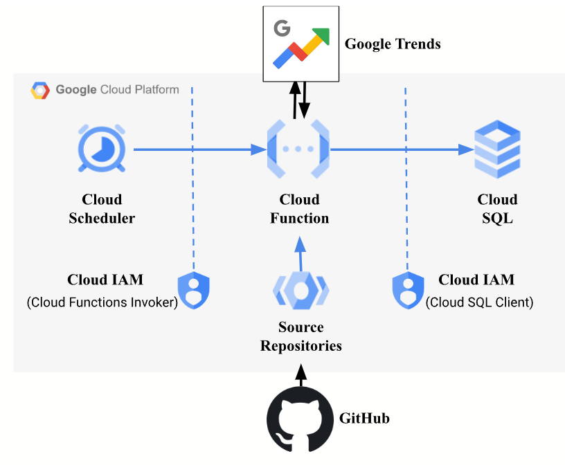

**# Integration of Google Trends with Google Cloud Platform**

The whole process starts from the GitHub repository, it contains the latest updated code. Google Source Repositories is used to make a real-time connection between GitHub, any changes made in Git are reflected as an update. While deploying the function the source code is redirected to the Google Source Repository.

A Cloud IAM service account has been created to restrict who can access the Cloud function and Cloud SQL. Specific roles are given to the service account to make sure it completes its task. Cloud scheduler is given “Cloud Function Invoker” to trigger the function, and Cloud function is given “Cloud SQL Client” to interact with Cloud SQL.

Once the function is triggered, it calls the Google Trends website for the data. The function extracts, frames, and sends the data to the Cloud SQL instance database we created.

